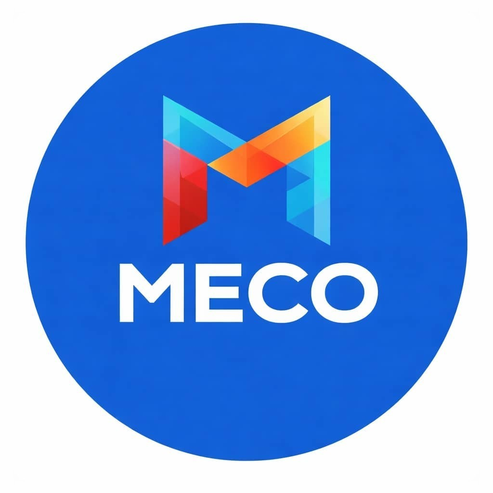

# 

<h1 align="center"> مؤسسة MonyCoin — MECO </h1>

  <strong>منظومة مالية رقمية لامركزية على شبكات البلوكتشين</strong>

  
  
  
  
  
  

---

  <a href="https://github.com/MonyCoin/meco-token/blob/main/WHITEPAPER.md">الورقة البيضاء</a>&nbsp;|&nbsp;
  <a href="https://github.com/MonyCoin/meco-token/blob/main/TOKENOMICS.md">التوكنوميكس</a>&nbsp;|&nbsp;
  <a href="https://github.com/MonyCoin/meco-token/blob/main/ROADMAP.md">خارطة الطريق</a>&nbsp;|&nbsp;
  <a href="https://github.com/MonyCoin/meco-token/blob/main/PROJECT_CHARTER.md">الميثاق المؤسسي</a>

  🌐 <a href="https://monycoin.github.io/meco_web/">الموقع الرسمي</a>&nbsp;&nbsp;
  𝕏 <a href="https://x.com/MoniCoinMECO">@MoniCoinMECO</a>&nbsp;&nbsp;
  💬 <a href="https://t.me/monycoin1">Telegram</a>

---

## 🔷 ما هو MECO؟

**MECO** هو رمز رقمي يعمل على شبكة **Solana**، تم تطويره بواسطة **مؤسسة MonyCoin الرقمية** بهدف بناء منظومة مالية مبسّطة تدعم المدفوعات الصغيرة والتحويلات الفورية بتكاليف منخفضة جداً.

> ⚡ **سريع • رخيص • غير قابل للتعديل** — عقد ذكي بدون صلاحيات سك أو تجميد

---

## 📋 المعلومات الأساسية

| | |
|:---|:---|
| **اسم العملة** | MonyCoin |
| **الرمز** | MECO |
| **الشبكة** | Solana (SPL Token) |
| **العقد** | `A5Ln25cfww33kfUSzBb89bMha7j1PnFQTy7H3FsQHN7W` |
| **إجمالي المعروض** | 1,000,000,000 MECO |
| **الرسوم** | 0% |
| **الحرق** | غير مُفعّل |
| **Mint Authority** | ✅ مُغلق نهائياً |
| **Freeze Authority** | ✅ معطّل |
| **نوع العقد** | غير قابل للتعديل |

---

## 🪙 توزيع التوكنوميكس
